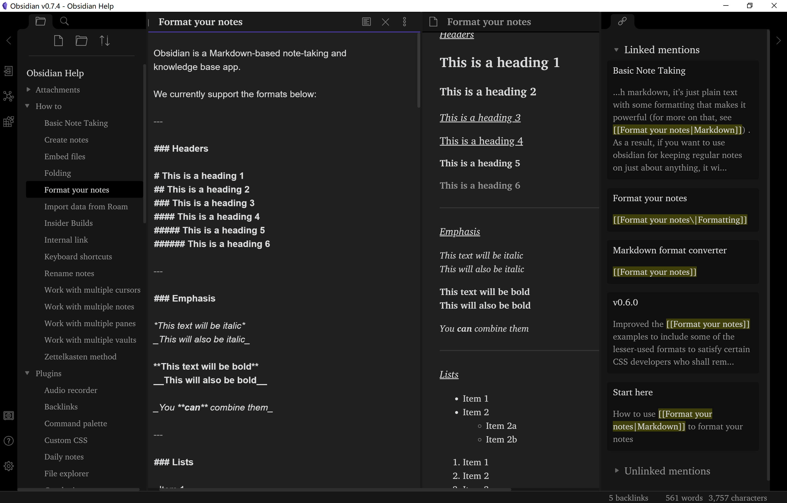

# obsidian-papers-theme
A simple yet delicate theme for the notetaking app Obsidian inspired by LaTeX editor and journal papers.

## Highlights

This theme focuses more on improving the writing experience via the following approaches:

- All lines in edit mode are made equal in font size and height in order to make the writting experience close to writting plain text in LaTeX editors. 
- Preview mode style is carefully designed. Researchers may find it similar to Elsevier journal papers. 
- Backlinks from a single note are grouped by a dark shade to avoid visual confusion.
- A simple Andy Matuschak mode is activated by default.
- Scrollbars are made smaller to tidy-up the workspace.
- Images are smaller (50%) by default.

## Screenshots

## Installation

1. Download obsidian.css to your Obsidian vault folder.
2. `Charter` font (included with macOS) is required. For Windows users, It can be downloaded from [here](https://practicaltypography.com/charter.html).
3. In Obsidian, click Settings->Plugins and turn on "Custom CSS".
